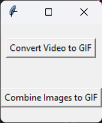

# GIF Maker

Create GIFs from videos or combine multiple images into a GIF using a simple GUI application.

## Details

This application is built using Python with the help of the following libraries:

- `tkinter` for GUI creation
- `moviepy` for video processing
- `Pillow` for image manipulation

### Installation

Before running the application, you need to install the required packages: pip install moviepy Pillow

## Features

- **Video to GIF**: Convert a segment of a video into a GIF.
- **Images to GIF**: Combine 2 to 10 images into a single GIF.

## Getting Started

1. Clone the repository.
2. Navigate to the directory and run the script.
3. Follow the GUI prompts to create your GIFs.

## How to Use

1. Launch the application.
2. Choose between converting a video segment to GIF or combining multiple images into a GIF.
3. If you choose the video option, select the video file, define the segment you want to convert, and specify the loop duration.
4. If you choose the images option, select between 2 and 10 images, specify the frame duration, and set the loop duration.
5. Save the generated GIF to your desired location.

## Screenshots

## Contributions

Feel free to fork the repository and submit pull requests. All contributions are welcome!

## License

This project is licensed under the MIT License. See [LICENSE](LICENSE) for details.

## Acknowledgements

- Special mentions to `moviepy` and `Pillow` communities for the amazing libraries.